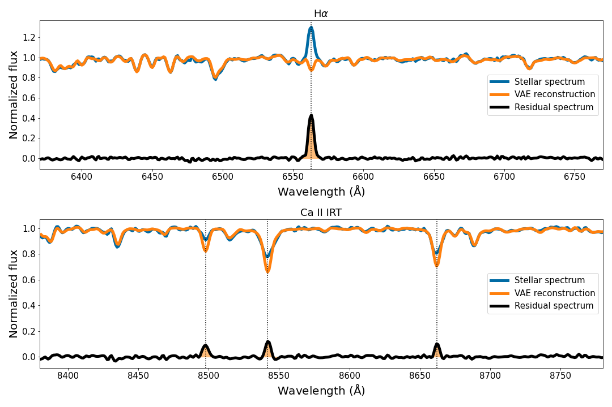

# Investigation of stellar magnetic activity using VAE

The variational autoencoder (VAE) model for [Xiang, Gu & Cao (2022)](https://doi.org/10.1093/mnras/stac1693).

The purpose of this VAE model is to generate the inactive template spectra in an unsupervised manner. After subtracting the reference templates from the observed stellar spectra, we can measure the residual emissions of the chromospheric indicators, such as Halpha and Ca II IRT lines, to quantify the activity level of stars.

The unsupervised VAE model is efficient for the analysis of the stellar magnetic activity in large spectroscopic surveys, since it do not need to know any stellar parameters or perform the template matching with the stellar spectral library. We trained the model on the selected inactive spectra in the LAMOST-K2 database, and the details can be found in the paper. 

We also trained a VAE neural network to model the simulated CSST slitless spectra, whose spectral resolution is much lower (≥200), to search for the Halpha emission.

We provide the Jupyter notebook as well as 1000 LAMOST spectra and the corresponding degraded ones (simulate the CSST slitless spectra) for the demo.

## Requirements

* h5py
* tqdm
* numpy
* joblib
* pytorch
* matplotlib
* scikit-learn
