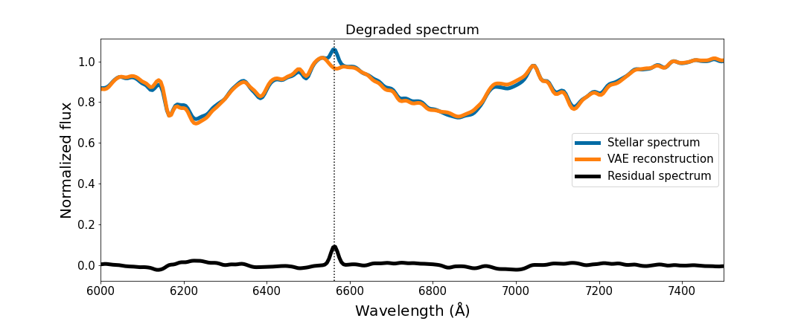

# Investigation of stellar magnetic activity using variational autoencoder based on low-resolution spectroscopic survey

The variational autoencoder (VAE) models for [Xiang, Gu & Cao, 2022, MNRAS, 514, 4781](http://arxiv.org/abs/2206.07257).

The purpose of this VAE model is to generate the inactive template spectra, which are used for the spectral subtraction analysis, in an unsupervised manner. After subtracting the reference spectra (photospheric contributions) from the observed stellar spectra, we can measure the residual emissions of the chromospheric indicators, such as Halpha and Ca II IRT lines, to quantify the activity level of stars. We applied the VAE to the low-resolution spectra (R=1800) of the LAMOST-K2 survey to investigate the stellar magnetic activity.

We also trained a VAE neural network with the same hidden architecture on the simulated CSST slitless spectra, whose resolving power is much lower (R≥200), to search for the Halpha emission. We can use this model to investigate the stellar activity with the CSST all-sky survey, which will deliver unprecedented photometric and spectroscopic data in the future.

The unsupervised VAE model is very efficient for the analysis on large sample of stellar spectra, since it does not need to know any stellar parameters or perform the template matching with the stellar spectral library conventionally.

We trained the model on the selected spectra of the inactive stars in the LAMOST-K2 survey. We manually added Gaussian noise and emission-like features to the training set, similar to that for the denoising autoencoder (DAE), to improve the robustness of our model to peculiar stellar spectra. More details can be found in the associated paper.

## Demo

We provide a Jupyter notebook as well as 1000 LAMOST spectra and the corresponding degraded ones (the simulated CSST slitless spectra) for the demo show.

### Requirements

* h5py
* tqdm
* numpy
* joblib
* pytorch
* matplotlib
* scikit-learn

## Citing

If you find our work useful, please consider to cite our paper:

    @article{10.1093/mnras/stac1693,
        author = {Xiang, Yue and Gu, Shenghong and Cao, Dongtao},
        title = "{Investigation of stellar magnetic activity using variational autoencoder based on low-resolution spectroscopic survey}",
        journal = {Monthly Notices of the Royal Astronomical Society},
        volume = {514},
        number = {4},
        pages = {4781-4793},
        year = {2022},
        month = {06},
        issn = {0035-8711},
        doi = {10.1093/mnras/stac1693},
        url = {https://doi.org/10.1093/mnras/stac1693},
        eprint = {https://academic.oup.com/mnras/article-pdf/514/4/4781/44456200/stac1693.pdf},
    }
